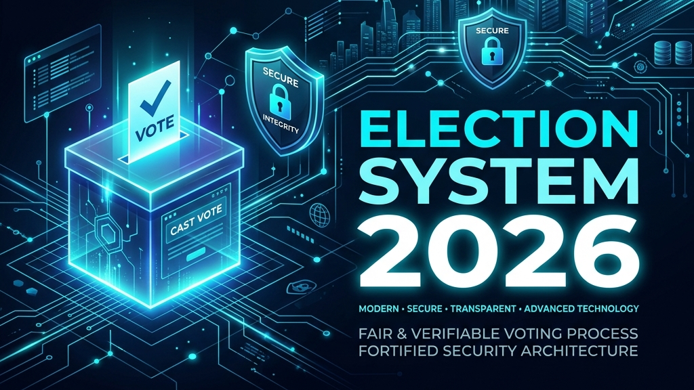

<p align="center">
  
</p>

# 🗳️ Election System 2026

<p align="center">
  <strong>A secure, local-area network (LAN) based voting system built with Java for school student elections.</strong>
</p>

<p align="center">
  <a href="https://www.oracle.com/java/technologies/downloads/"></a>
  
  
  
  
</p>

---

## 📌 Overview

This project is a desktop-based election management suite designed to modernize the voting process. It eliminates manual counting errors and ensures data privacy by keeping all voting records stored locally within the school's private network.

---

## ✨ Key Features

- **🖥️ Dual-Mode Architecture**: Run as a **Server** to host the election and tally results, or as a **Client** to allow students to cast votes from individual terminals.
- **📊 Real-time Tallying**: Automatic calculation of votes with built-in protection against duplicate submissions using unique Student ID numbers.
- **🔒 Admin Security**: Dedicated Admin panel for real-time monitoring of election results, protected by a hard-coded security key.
- **📂 Data Portability**: Results are automatically exported to `election_results.csv`, making them instantly ready for official reporting in Microsoft Excel or Google Sheets.

---

## 🚀 Getting Started

Follow these steps to set up and run the voting system in your local network.

### 📋 Prerequisites

- **Java Development Kit (JDK) 21+** installed on all participating machines.
- Ensure all terminals are connected to the same **Local Area Network (LAN)**.

### ⚙️ Running the Application

1. **Compile the source files:**
   ```bash
   javac *.java
   ```

2. **Execute the main program:**
   ```bash
   java main
   ```

### 🖥️ Network Setup

- **Admin Machine**: Select **"Run as Server"**. Note the IP address displayed in the application title bar.
- **Client Machine(s)**: Select **"Connect as Voter"** and enter the IP address displayed on the Admin (Server) terminal.

---

## 🔒 Security Notice

This system uses a dedicated `ElectionSystem/` folder to manage data. This folder is ignored by Git to ensure that sensitive student voting records are never uploaded to public or shared repositories.

---

